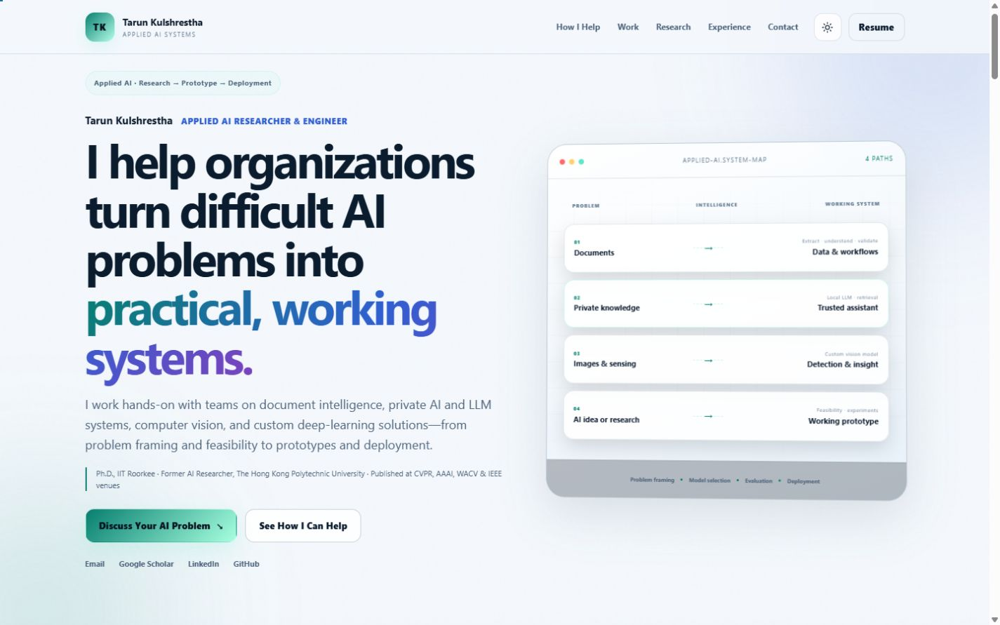

# Tarun Kulshrestha — Personal Portfolio



A modern, responsive personal site for discussing difficult applied AI problems, technical collaborations, and research-to-prototype work. It is ready for direct deployment on GitHub Pages without npm or a build process.

## Portfolio positioning

The homepage is organized around a client-first journey:

- Clear applied-AI positioning and project discussion path in the first viewport
- Four problem areas: documents, private knowledge, visual data, and AI feasibility
- Selected non-confidential prototypes: DocsMind and BusinessAgent OS
- Research credibility through curated publications and PolyU/UBDA experience
- Technical depth and selected workshops as supporting evidence
- A downloadable résumé as a secondary reference

## GitHub Pages address

Because the GitHub account is `tarunkul`, the personal-site repository must be named exactly:

```text
tarunkul.github.io
```

The published address will be:

```text
https://tarunkul.github.io/
```

## Preview locally

From this folder, run:

```bash
python3 -m http.server 8000
```

Then open `http://localhost:8000`.

## Deploy with the GitHub website

1. Sign in to the `tarunkul` GitHub account.
2. Create a new **Public** repository named `tarunkul.github.io`.
3. Extract the downloaded ZIP on your computer.
4. Open the extracted `tarunkul.github.io` folder.
5. Upload the files and folders inside it to the repository. Do not upload the ZIP itself or create an extra nested folder.
6. Commit the files to the `main` branch.
7. Open **Settings → Pages**.
8. Under **Build and deployment**, select **Deploy from a branch**.
9. Select branch `main`, folder `/(root)`, and click **Save**.
10. Wait a few minutes and open `https://tarunkul.github.io/`.

## Deploy with Terminal

```bash
cd /path/to/tarunkul.github.io
git init
git add .
git commit -m "Launch personal portfolio"
git branch -M main
git remote add origin https://github.com/tarunkul/tarunkul.github.io.git
git push -u origin main
```

Then configure **Settings → Pages → Deploy from a branch → main → /(root)**.

## Update later

Replace or edit the files, then run:

```bash
git add .
git commit -m "Update portfolio"
git push
```

## Main files

- Content: `index.html`
- Design: `styles.css`
- Interactions: `script.js`
- Resume: `assets/Tarun_Kulshrestha_Resume.pdf`
- Share image: `assets/og-cover.svg`
- Deployment checklist: `DEPLOYMENT.md`

The contact form opens a pre-filled email in the visitor's default email application; its form data is not stored by the site. The live site uses [MapMyVisitors](https://mapmyvisitors.com/) for anonymous traffic analytics such as page views, approximate location, referrer, and device/browser information. It does not identify visitors by name; MapMyVisitors processes analytics requests under its [privacy policy](https://mapmyvisitors.com/b/policy).
